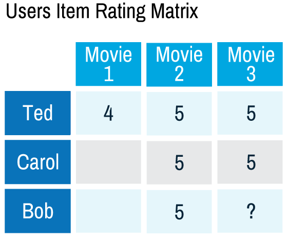
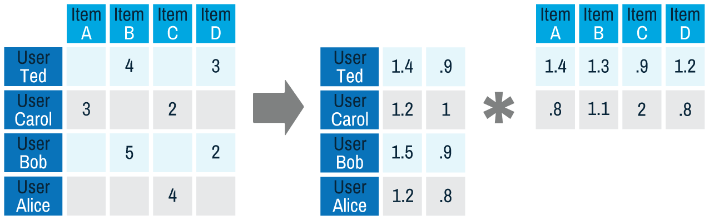
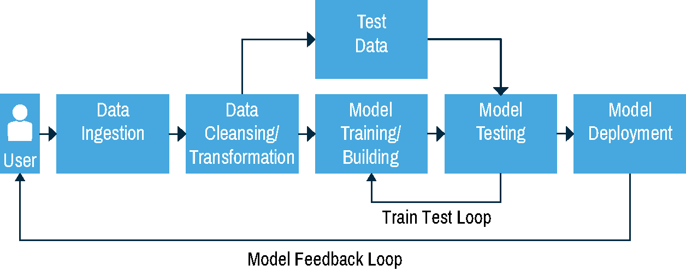
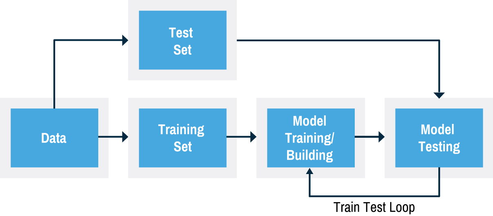

## Building a Recommendation Engine with Spark
Recommendation systems help narrow your choices to those that best meet your particular needs, and they are among the most popular applications of big data processing. This use case uses machine learning to perform parallel and iterative processing in Spark and covers:
- Collaborative filtering for recommendations with Spark
- Loading and exploring the sample data set with Spark
- Using Spark MLlib's Alternating Least Squares algorithm to make movie recommendations
- Testing the results of the recommendations

### Collaborative Filtering with Spark
Collaborative filtering algorithms recommend items (this is the _filtering_ part) based on preference information from many users (this is the _collaborative_ part). The collaborative filtering approach is based on similarity; the basic idea is people who liked similar items in the past will like similar items in the future. In the example below, Ted likes movies A, B, and C. Carol likes movies B and C. Bob likes movie B. To recommend a movie to Bob, we calculate that users who liked B also liked C, so C is a possible recommendation for Bob. Of course, this is a tiny example. In real situations, we would have much more data to work with.
<figure><figcaption>Users Item Rating Matrix</figcaption></figure>

Spark MLlib implements a collaborative filtering algorithm called [Alternating Least Squares (ALS)](https://spark.apache.org/docs/latest/mllib-collaborative-filtering.html).

ALS approximates the sparse user item rating matrix of dimension K as the product of two dense matrices--User and Item factor matrices of size U×K and I×K (see picture below). The factor matrices are also called latent feature models. The factor matrices represent hidden features which the algorithm tries to discover. One matrix tries to describe the latent or hidden features of each user, and one tries to describe latent properties of each movie.
<figure><figcaption>Calculation of a recommendation</figcaption></figure>

ALS is an _iterative algorithm_. In each iteration, the algorithm alternatively fixes one factor matrix and solves for the other, and this process continues until it converges. This alternation between which matrix to optimize is where the "alternating" in the name comes from.

### Typical Machine Learning Workflow
A typical machine learning workflow is shown below.
<figure><figcaption>Maching Learning Workflow</figcaption></figure>

This code will perform the following steps:
1. Load the sample data.
2. Parse the data into the input format for the ALS algorithm.
3. Split the data into two parts: one for building the model and one for testing the model.
4. Run the ALS algorithm to build/train a user product matrix model.
5. Make predictions with the training data and observe the results.
6. Test the model with the test data.

### The Sample Set
The table below shows the Rating data fields with some sample data:

user id | movie id | rating
------- | -------- | ------
1       | 1193     | 4

The table below shows the Movie data fields with some sample data:

movie id | title     | genre
-------- | --------- | ---------
1        | Toy Story | animation

First, let's explore the data using Spark DataFrames with questions like:
- Count the max, min ratings along with the number of users who have rated a movie.
- Display the title for movies with ratings > 4

## Loading Data into Spark DataFrames
First, we will import some packages and instantiate a sqlContext, which is the entry point for working with structured data (rows and columns) in Spark and allows for the creation of DataFrame objects.
<pre data-code-language="scala" data-executable="true" data-type="programlisting">
// SQLContext entry point for working with structured data
val sqlContext = new org.apache.spark.sql.SQLContext(sc)

// This is used to implicitly convert an RDD to a DataFrame.
import sqlContext.implicits._
// Import Spark SQL data types
import org.apache.spark.sql._
// Import mllib recommendation data types
import org.apache.spark.mllib.recommendation.{ALS,
  MatrixFactorizationModel, Rating}
</pre>

Below we use Scala case classes to define the Movie and User schemas corresponding to the movies.dat and users.dat files.
<pre data-code-language="scala" data-executable="true" data-type="programlisting">
// input format MovieID::Title::Genres
case class Movie(movieId: Int, title: String, genres: Seq[String])

// input format is UserID::Gender::Age::Occupation::Zip-code
case class User(userId: Int, gender: String, age: Int,
  occupation: Int, zip: String)
</pre>

The functions below parse a line from the movie.dat and user.dat files into the corresponding Movie and User classes.
<pre data-code-language="scala" data-executable="true" data-type="programlisting">
// function to parse input into Movie class
def parseMovie(str: String): Movie = {
      val fields = str.split("::")
      assert(fields.size == 3)
      Movie(fields(0).toInt, fields(1), Seq(fields(2)))
 }

// function to parse input into User class
def parseUser(str: String): User = {
      val fields = str.split("::")
      assert(fields.size == 5)
      User(fields(0).toInt, fields(1).toString, fields(2).toInt,
        fields(3).toInt, fields(4).toString)
 }
</pre>

Below we load the data from the ratings.dat file into a Resilient Distributed Dataset (RDD). RDDs can have **transformations** and **actions**.
<pre data-code-language="scala" data-executable="true" data-type="programlisting">
// load the data into a RDD
val ratingText = sc.textFile("/home/jovyan/work/datasets/spark-ebook/ratings.dat")

// Return the first element in this RDD
ratingText.first()
</pre>

The _first()_ **action** returns the first element in the RDD, which is the String **"1::1193::5::978300760"**.

We use the org.apache.spark.mllib.recommendation.Rating class for parsing the ratings.dat file. Later we will use the Rating class as input for the ALS run method.

Then we use the map **transformation** on _ratingText_, which will apply the _parseRating_ function to each element in _ratingText_ and return a new RDD of Rating objects. We cache the ratings data, since we will use this data to build the matrix model. Then we get the counts for the number of ratings, movies and users.
<pre data-code-language="scala" data-executable="true" data-type="programlisting">
// function to parse input UserID::MovieID::Rating
// Into org.apache.spark.mllib.recommendation.Rating class
def parseRating(str: String): Rating= {
      val fields = str.split("::")
      Rating(fields(0).toInt, fields(1).toInt, fields(2).toDouble)
}

// create an RDD of Ratings objects
val ratingsRDD = ratingText.map(parseRating).cache()

println("Total number of ratings: " + ratingsRDD.count())

println("Total number of movies rated: " +
  ratingsRDD.map(&#95;.product).distinct().count())

println("Total number of users who rated movies: " +
  ratingsRDD.map(&#95;.user).distinct().count())
</pre>

### Explore and Query with Spark DataFrames
Spark SQL provides a programming abstraction called DataFrames. A DataFrame is a distributed collection of data organized into named columns. Spark supports automatically converting an RDD containing case classes to a DataFrame with the method _toDF_, and the case class defines the schema of the table.

Below we load the data from the users and movies data files into an RDD, use the _map()_ **transformation** with the parse functions, and then call _toDF()_ which returns a DataFrame for the RDD. Then we register the DataFrames as temp tables so that we can use the tables in SQL statements.
<pre data-code-language="scala" data-executable="true" data-type="programlisting">
// load the data into DataFrames
val usersDF = sc.textFile("/home/jovyan/work/datasets/spark-ebook/users.dat").
  map(parseUser).toDF()
val moviesDF = sc.textFile("/home/jovyan/work/datasets/spark-ebook/movies.dat").
  map(parseMovie).toDF()

// create a DataFrame from the ratingsRDD
val ratingsDF = ratingsRDD.toDF()

// register the DataFrames as a temp table
ratingsDF.registerTempTable("ratings")
moviesDF.registerTempTable("movies")
usersDF.registerTempTable("users")
</pre>

DataFrame _printSchema()_ prints the schema to the console in a tree format.
<pre data-code-language="scala" data-executable="true" data-type="programlisting">
usersDF.printSchema()

moviesDF.printSchema()

ratingsDF.printSchema()
</pre>

Here are some example queries using Spark SQL with DataFrames on the Movie Lens data. The first query gets the maximum and minimum ratings along with the count of users who have rated a movie.
<pre data-code-language="scala" data-executable="true" data-type="programlisting">
// Get the max, min ratings along with the count of users who have
// rated a movie.
val results = sqlContext.sql(
  """select movies.title, movierates.maxr, movierates.minr, movierates.cntu
    from(SELECT ratings.product, max(ratings.rating) as maxr,
    min(ratings.rating) as minr,count(distinct user) as cntu
    FROM ratings group by ratings.product ) movierates
    join movies on movierates.product=movies.movieId
    order by movierates.cntu desc""")

// DataFrame show() displays the top 20 rows in  tabular form
results.show()
</pre>

The query below finds the users who rated the most movies, then finds which movies the most active user rated higher than 4. We will get recommendations for this user later.
<pre data-code-language="scala" data-executable="true" data-type="programlisting">
// Show the top 10 most-active users and how many times they rated
// a movie
val mostActiveUsersSchemaRDD = sqlContext.sql(
  """SELECT ratings.user, count(&#42;) as ct from ratings
  group by ratings.user order by ct desc limit 10""")

println(mostActiveUsersSchemaRDD.collect().mkString("\n"))

// Find the movies that user 4169 rated higher than 4
val results = sqlContext.sql("""SELECT ratings.user, ratings.product,
  ratings.rating, movies.title FROM ratings JOIN movies
  ON movies.movieId=ratings.product
  where ratings.user=4169 and ratings.rating > 4""")

results.show
</pre>

### Using ALS with the Movie Ratings Data
Now we will use the MLlib ALS algorithm to learn the latent factors that can be used to predict missing entries in the user-item association matrix. First we separate the ratings data into training data (80%) and test data (20%). We will get recommendations for the training data, and then we will evaluate the predictions with the test data. This process of taking a subset of the data to build the model and then verifying the model with the remaining data is known as cross validation; the goal is to estimate how accurately a predictive model will perform in practice. To improve the model, this process is often done multiple times with different subsets; we will only do it once.
<figure><figcaption>Training Loop</figcaption></figure>

We run ALS on the input trainingRDD of Rating(user, product, rating) objects with the rank and Iterations parameters:
- rank is the number of latent factors in the model.
- iterations is the number of iterations to run.

The ALS run(trainingRDD) method will build and return a MatrixFactorizationModel, which can be used to make product predictions for users.
<pre data-code-language="scala" data-executable="true" data-type="programlisting">
// Randomly split ratings RDD into training  
// data RDD (80%) and test data RDD (20%)
val splits = ratingsRDD.randomSplit(Array(0.8, 0.2), 0L)

val trainingRatingsRDD = splits(0).cache()
val testRatingsRDD = splits(1).cache()

val numTraining = trainingRatingsRDD.count()
val numTest = testRatingsRDD.count()
println(s"Training: $numTraining, test: $numTest.")

// build a ALS user product matrix model with rank=20, iterations=10
val model = (new ALS().setRank(20).setIterations(10)
  .run(trainingRatingsRDD))
</pre>

### Making Predictions
Now we can use the MatrixFactorizationModel to make predictions. First, we will get movie predictions for the most active user, 4169, with the recommendProducts() method, which takes as input the userid and the number of products to recommend. Then we print out the recommended movie titles.
<pre data-code-language="scala" data-executable="true" data-type="programlisting">
// Get the top 4 movie predictions for user 4169
val topRecsForUser = model.recommendProducts(4169, 5)

// get movie titles to show with recommendations
val movieTitles=moviesDF.map(array => (array(0), array(1))).
  collectAsMap()

// print out top recommendations for user 4169 with titles
topRecsForUser.map(rating => (movieTitles(
  rating.product), rating.rating)).foreach(println)
</pre>

### Evaluating the Model
Next, we will compare predictions from the model with actual ratings in the _testRatingsRDD_. First we get the user product pairs from the _testRatingsRDD_ to pass to the MatrixFactorizationModel _predict_(user: Int, product: Int) method, which will return predictions as _Rating_(user, product, rating) objects.
<pre data-code-language="scala" data-executable="true" data-type="programlisting">
// get user product pair from testRatings
val testUserProductRDD = testRatingsRDD.map {
  case Rating(user, product, rating) => (user, product)
}

// get predicted ratings to compare to test ratings
val predictionsForTestRDD  = model.predict(testUserProductRDD)

predictionsForTestRDD.take(10).mkString("\n")
</pre>

Now we will compare the test predictions to the actual test ratings. First we put the predictions and the test RDDs in this key, value pair format for joining: ((user, product), rating). Then we print out the (user, product), (test rating, predicted rating) for comparison.
<pre data-code-language="scala" data-executable="true" data-type="programlisting">
// prepare predictions for comparison
val predictionsKeyedByUserProductRDD = predictionsForTestRDD.map{
  case Rating(user, product, rating) => ((user, product), rating)
}

// prepare test for comparison
val testKeyedByUserProductRDD = testRatingsRDD.map{
  case Rating(user, product, rating) => ((user, product), rating)
}

//Join the test with predictions
val testAndPredictionsJoinedRDD = testKeyedByUserProductRDD.
  join(predictionsKeyedByUserProductRDD)

// print the (user, product),( test rating, predicted rating)
testAndPredictionsJoinedRDD.take(3).mkString("\n")
</pre>

The example below finds false positives by finding predicted ratings which were >= 4 when the actual test rating was <= 1. There were 557 false positives out of 199,507 test ratings.
<pre data-code-language="scala" data-executable="true" data-type="programlisting">
val falsePositives = (
  testAndPredictionsJoinedRDD.filter{
    case ((user, product), (ratingT, ratingP)) => (ratingT &lt;= 1 && ratingP >=4)
  })
falsePositives.take(2)

falsePositives.count()
</pre>

Next we evaluate the model using Mean Absolute Error (MAE). MAE is the absolute differences between the predicted and actual targets.
<pre data-code-language="scala" data-executable="true" data-type="programlisting">
// Evaluate the model using Mean Absolute Error (MAE) between test
// and predictions
val meanAbsoluteError = testAndPredictionsJoinedRDD.map {
  case ((user, product), (testRating, predRating)) =>
    val err = (testRating - predRating)
    Math.abs(err)
}.mean()
println(meanAbsoluteError)
</pre>


