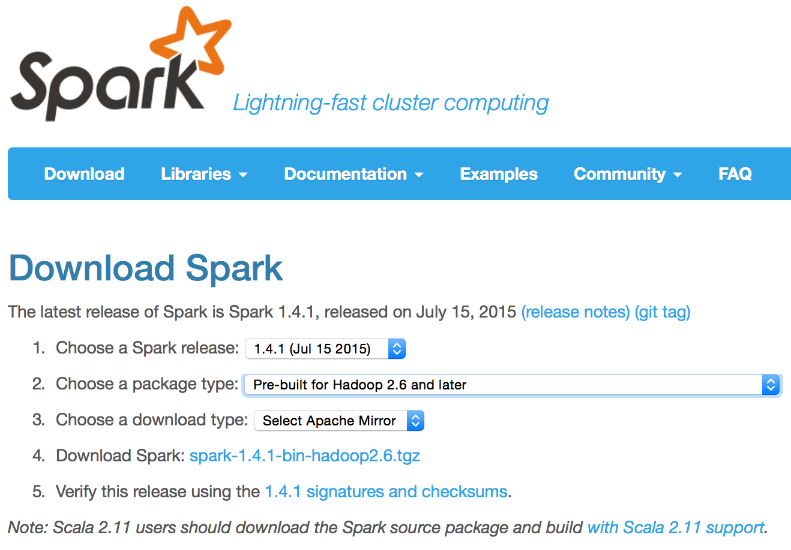
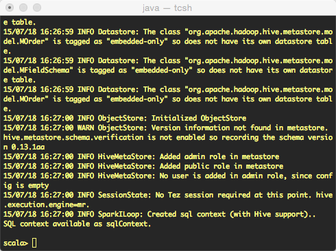
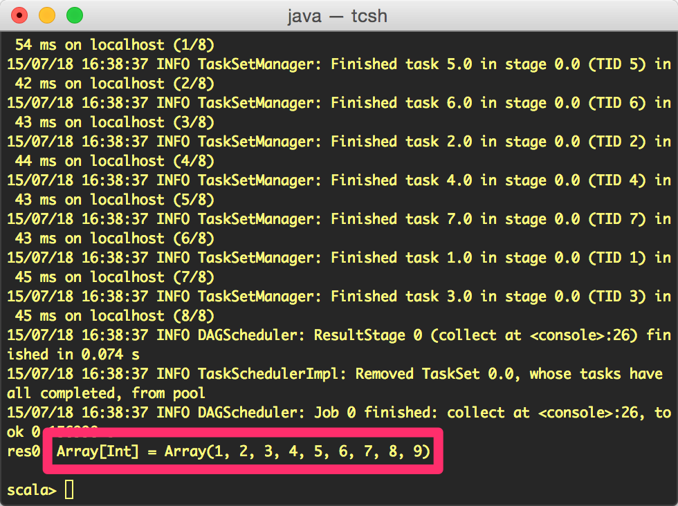

# Getting Started with Spark
Although cluster-based installations of Spark can become large and relatively complex by integrating with Mesos, Hadoop, Cassandra, or other systems, it is straightforward to download Spark and configure it in standalone mode on a laptop or server for learning and exploration. This low barrier to entry makes it relatively easy for individual developers and data scientists to get started with Spark, and for businesses to launch pilot projects that do not require complex re-tooling or interference with production systems.

Apache Spark is open source software, and can be freely [downloaded](https://spark.apache.org/downloads.html) from the Apache Software Foundation. Spark requires at least version 6 of Java, and at least version 3.0.4 of Maven. Other dependencies, such as Scala and Zinc, are automatically installed and configured as part of the installation process.

[Build options](http://spark.apache.org/docs/latest/building-spark.html), including optional links to data storage systems such as Hadoop's HDFS or Hive, are discussed in more detail in Spark's online documentation.

A [Quick Start](https://spark.apache.org/docs/1.4.1/quick-start.html) guide, optimized for developers familiar with either Python or Scala, is an accessible introduction to working with Spark. MapR also provides a [tutorial](https://www.mapr.com/products/mapr-sandbox-hadoop/tutorials/spark-tutorial) linked to their simplified deployment of Hadoop, the [MapR Sandbox](https://www.mapr.com/products/mapr-sandbox-hadoop).

## A Very Simple Spark Installation
Follow these simple steps to download Java, Spark, and Hadoop and get them running on a laptop (in this case, one running Mac OS X). If you do not currently have the [Java JDK](http://www.oracle.com/technetwork/java/javase/downloads/index.html) (version 7 or higher) installed, download it and follow the steps to install it for your operating system.

Visit the [Spark downloads page](https://spark.apache.org/downloads.html), select a pre-built package, and download Spark. Double-click the archive file to expand its contents ready for use.
<figure><figcaption><span class="label">Figure 2-1: </span>Apache Spark download page, with a pre-built package</figcaption></figure>

## Testing Spark
Open a text console, and navigate to the newly created directory. Start Spark's interactive shell:

```bash
./bin/spark-shell
```

A series of messages will scroll past as Spark and Hadoop are configured. Once the scrolling stops, you will see a simple prompt.
<figure><figcaption><span class="label">Figure 2-2: </span>Terminal window after spark starts running</figcaption></figure>

At this prompt, let's create some data; a simple sequence of numbers from 1 to 50,000.

```scala
val data = 1 to 50000
```

Now, let's place these 50,000 numbers into a Resilient Distributed Dataset (RDD) which we'll call sparkSample. It is this RDD upon which Spark can perform analysis.

```scala
val sparkSample = sc.parallelize(data)
```

Now we can filter the data in the RDD to find any values of less than 10.

```scala
sparkSample.filter(_ < 10).collect()
```

<figure><figcaption><span class="label">Figure 2-3: </span>Values less than 10, from a set of 50,000 numbers</figcaption></figure>

Spark should report the result, with an array containing any values less than 10. Richer and more complex examples are available in resources mentioned elsewhere in this guide.

Spark has a very low entry barrier to get started, which eases the burden of learning a new toolset. Barrier to entry should always be a consideration for any new technology a company evaluates for enterprise use.
