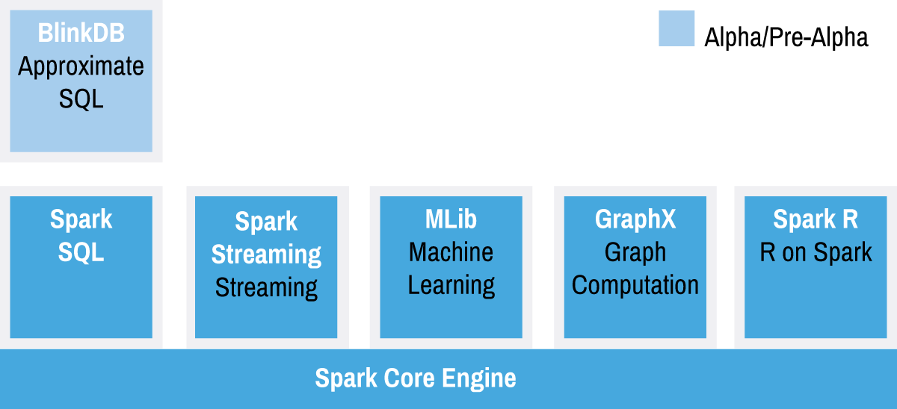

# Spark in more detail

The open source Spark is a top-level project of the Apache Software Foundation, designed to be used with a range of programming languages and on a variety of architectures. Spark’s speed, simplicity, and broad support for existing development environments and storage systems make it increasingly popular with a wide range of developers, and relatively accessible to those learning to work with it for the first time. The project supporting Spark’s ongoing development is one of Apache’s largest and most vibrant, with over 500 contributors from more than 200 organizations responsible for code in the current software release.

## Development Language Support

Comprehensive support for the development languages with which developers are already familiar is important in ensuring that Spark may be learned relatively easily, and incorporated into existing applications as straightforwardly as possible. Programming languages supported by Spark include:
* [Java](https://spark.apache.org/docs/latest/api/java/index.html)
* [Python](https://spark.apache.org/docs/latest/api/python/index.html)
* [Scala](https://spark.apache.org/docs/latest/api/scala/index.html)
* [SQL](https://spark.apache.org/docs/latest/sql-programming-guide.html)
* [R](https://spark.apache.org/docs/latest/api/R/index.html)

Languages like Python are often considered to perform poorly, especially in relation to alternatives such as Java. Although this concern is justified in some development environments, it is less significant in the distributed cluster model in which Spark will typically be deployed. Any slight loss of performance introduced by use of Python can be compensated for elsewhere in the design and operation of the cluster. Familiarity with your chosen language is likely to be far more important than the raw speed of code prepared in that language.

Extensive examples and tutorials exist for Spark in a number of places, including the [Apache Spark project website](https://spark.apache.org/examples.html) itself. These tutorials normally include code snippets in Java, Python and Scala.

The Structured Query Language, SQL, is widely used in relational databases, and simple SQL queries are normally well-understood by developers, data scientists and other knowledge workers familiar with asking questions of any data storage system. The Apache Spark module, Spark SQL, offers native support for SQL and simplifies the process of querying data stored in Spark’s own Resilient Distributed Dataset model alongside data from external sources such as relational databases and data warehouses.

Support for the data science package, R, is more recent. The SparkR package first appeared in release 1.4 of Apache Spark (June 2015), but given the popularity of R amongst data scientists and statisticians, it is likely to prove an important addition to Spark’s set of supported languages.

## Standalone, or part of a cluster

As we saw above, for developers looking to get started with Spark, it’s easy to download and install on a laptop or virtual machine.

But for production workloads, operating at scale, a single laptop or virtual machine is unlikely to be sufficient. In these circumstances Spark will normally run on an existing big data cluster. These clusters are often also used for Hadoop jobs, and Hadoop’s YARN resource manager will typically then be used to manage the whole cluster (including Spark). [Running Spark on YARN](https://spark.apache.org/docs/latest/running-on-yarn.html), from the Apache Spark project, provides more configuration details.

For those who prefer alternative resource managers, Spark can also run just as easily on clusters controlled by Apache Mesos. [Running Spark on Mesos](https://spark.apache.org/docs/latest/running-on-mesos.html), from the Apache Spark project, provides more configuration details.

A series of scripts bundled with current releases of Spark simplify the process of launching Spark on Amazon Web Services’ Elastic Compute Cloud (EC2). [Running Spark on EC2](https://spark.apache.org/docs/latest/ec2-scripts.html), from the Apache Spark project, provides more configuration details.

## Storage Options

Although often linked with the Hadoop file system, HDFS, Spark can integrate with a range of commercial or open source third-party data storage systems including:
* Amazon S3
* Apache Cassandra
* Apache Hadoop (HDFS)
* Apache HBase
* Apache Hive
* Berkeley’s Tachyon project

Developers are likely to simply choose the data storage system they are already using elsewhere in their workflow.

## The Spark Stack

The Spark project stack currently comprises Spark Core, plus four libraries that are optimized to address the requirements of four different use cases. Individual applications will typically require Spark Core and at least one of these libraries. Spark’s flexibility and power become most apparent in applications that require the combination of two or more of these libraries on top of Spark Core.

* **Spark Core**: This is the heart of Spark, and is responsible for management functions such as task scheduling. Spark Core implements and depends upon a programming abstraction known as Resilient Distributed Datasets (RDDs), which are discussed in more detail below.
* **Spark SQL**: This is Spark’s module for working with structured data, and it is designed to support workloads that combine familiar SQL database queries with more complicated algorithm-based analytics. Spark SQL supports the open source Hive project, and its SQL-like HiveQL query syntax. Spark SQL also supports JDBC and ODBC connections, enabling a degree of integration with existing databases, data warehouses and business intelligence tools. JDBC connectors can also be used to integrate with Apache Drill, opening up access to an even broader range of data sources.
* **Spark Streaming**: This module supports scalable and fault-tolerant processing of streaming data, and can integrate with established sources of data streams like Flume (optimized for data logs) and Kafka (optimized for distributed messaging). Running in a production environment, Spark Streaming will normally rely upon capabilities from external projects like ZooKeeper and HDFS to deliver resilient scalability. Spark Streaming’s design, and its use of Spark’s RDD abstraction, are meant to ensure that applications written for streaming data can be repurposed to analyze batches of historical data with little modification. In real-world application scenarios, where observation of historical trends often augments stream-based analysis of current events, this capability is of great value in streamlining the development process.
* **MLlib**: This is Spark’s scalable machine learning library, which implements a set of commonly used machine learning and statistical algorithms. These include correlations and hypothesis testing, classification and regression, clustering, and principal components analysis.
* **GraphX**: This module began life as a separate UC Berkeley research project, which was eventually donated to the Apache Spark project. GraphX supports analysis of and computation over graphs of data, and supports a version of graph processing’s Pregel API. GraphX includes a number of widely understood graph algorithms, including PageRank.
* **Spark R**: This module was added to the 1.4.x release of Apache Spark, providing data scientists and statisticians using R with a lightweight mechanism for calling upon Spark’s capabilities.

## Resilient Distributed Datasets (RDDs)

The Resilient Distributed Dataset is a concept at the heart of Spark. It is designed to support in-memory data storage, distributed across a cluster in a manner that is demonstrably both fault-tolerant and efficient. Fault-tolerance is achieved, in part, by tracking the lineage of transformations applied to coarse-grained sets of data. Efficiency is achieved through parallelization of processing across multiple nodes in the cluster, and minimization of data replication between those nodes.
Once data is loaded into an RDD, two basic types of operation can be carried out:
* **Transformations**, which create a new RDD by changing the original through processes such as mapping, filtering, and more;
* **Actions**, such as counts, which measure but do not change the original data.
The original RDD remains unchanged – immutable – throughout. The chain of transformations from RDD1 to RDDn are logged, and can be repeated in the event of data loss or the failure of a cluster node.

Transformations are said to be lazily evaluated, meaning that they are not executed until a subsequent action has a need for the result. This will normally improve performance, as it can avoid the need to process data unnecessarily. It can also, in certain circumstances, introduce processing bottlenecks that cause applications to stall while waiting for a processing action to conclude.

Where possible, these RDDs remain in memory, greatly increasing the performance of the cluster, particularly in use cases with a requirement for iterative queries or processes.

## API Overview

Spark’s capabilities can all be accessed and controlled using a rich API. This supports Spark’s four principal development environments ([Scala](https://spark.apache.org/docs/latest/api/scala/index.html), [Java](https://spark.apache.org/docs/latest/api/java/index.html),  [Python](https://spark.apache.org/docs/latest/api/python/index.html), [R](https://spark.apache.org/docs/latest/api/R/index.html)), and extensive documentation is provided regarding the API’s instantiation in each of these languages. The [Spark Programming Guide](http://spark.apache.org/docs/latest/programming-guide.html) provides further detail, with comprehensive code snippets in Scala, Java and Python.
The Spark API was optimized for manipulating data, with a design that reduced common data science tasks from hundreds or thousands of lines of code to only a few.

An additional DataFrames API was added to Spark in 2015. DataFrames [offers](https://databricks.com/blog/2015/02/17/introducing-dataframes-in-spark-for-large-scale-data-science.html):
* Ability to scale from kilobytes of data on a single laptop to petabytes on a large cluster
* Support for a wide array of data formats and storage systems
* State-of-the-art optimization and code generation through the Spark SQL Catalyst optimizer
* Seamless integration with all big data tooling and infrastructure via Spark
* APIs for Python, Java, Scala, and R

For new users familiar with data frames in other programming languages, this API should make them feel at home. For existing Spark users, this extended API will make Spark easier to program, and at the same time improve performance through intelligent optimizations and code-generation.

## The Power of Data Pipelines

** It would be great to offer up a little more detail to really hammer the point. Like, performing ETL requires chaining together of processes, or complex tools that require special training. **

Much of Spark’s power lies in its ability to combine very different techniques and processes together into a single, coherent, whole. Outside Spark, the discrete tasks of selecting data, transforming that data in various ways, and then analyzing the transformed result in some way might easily require a series of separate processing frameworks such as Oozie. Spark, on the other hand, offers the ability to combine these together, crossing boundaries between batch, streaming and interactive workflows in ways that make the user more productive. Spark simplifies the management of these disparate processes, offering an integrated whole – a data pipeline – that is easier to configure, easier to run, and easier to maintain. In use cases such as ETL these pipelines can become extremely rich and complex, combining large numbers of inputs and a wide range of processing steps into a unified whole that consistently delivers the desired result.
