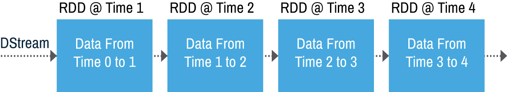
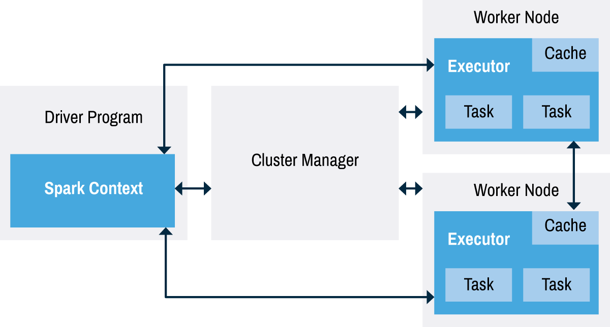

# Streaming Framework
Although now considered a key element of Spark, streaming capabilities were only introduced to the project with its 0.7 release (February 2013), emerging from the alpha testing phase with the 0.9 release (February 2014). Rather than being integral to the design of Spark, stream processing is a capability that has been added alongside Spark Core and its original design goal of rapid in-memory data processing.

Other stream processing solutions exist, including projects like Apache Storm and Apache Flink. In each of these, stream processing is a key design goal, offering some advantages to developers whose sole requirement is the processing of data streams. These solutions, for example, typically process the data stream event-by-event, while Spark adopts a system of chopping the stream into chunks (or micro-batches) to maintain compatibility and interoperability with Spark Core and Spark's other modules.

## The Details of Spark Streaming
Spark's real and sustained advantage over these alternatives is this tight integration between its stream and batch processing capabilities. Running in a production environment, Spark Streaming will normally rely upon capabilities from external projects like ZooKeeper and HDFS to deliver resilient scalability. In real-world application scenarios, where observation of historical trends often augments stream-based analysis of current events, this capability is of great value in streamlining the development process. For workloads in which streamed data must be combined with data from other sources, Spark remains a strong and credible option.


A streaming framework is only as good as its data sources. A strong messaging platform is the best way to ensure solid performance for any streaming system.

Spark Streaming supports the ingest of data from a wide range of data sources, including live streams from Apache Kafka, Apache Flume, Amazon Kinesis, Twitter, or sensors and other devices connected via TCP sockets. Data can also be streamed out of storage services such as HDFS and AWS S3. Data is processed by Spark Streaming, using a range of algorithms and high-level data processing functions like _map_, _reduce_, _join_ and _window_. Processed data can then be passed to a range of external file systems, or used to populate live dashboards.


Logically, Spark Streaming represents a continuous stream of input data as a discretized stream, or DStream. Internally, Spark actually stores and processes this DStream as a sequence of RDDs. Each of these RDDs is a snapshot of all data ingested during a specified time period, which allows Spark's existing batch processing capabilities to operate on the data.



The data processing capabilities in Spark Core and Spark's other modules are applied to each of the RDDs in a DStream in exactly the same manner as they would be applied to any other RDD: Spark modules other than Spark Streaming have no awareness that they are processing a data stream, and no need to know.

A basic RDD operation, _flatMap_, can be used to extract individual words from lines of text in an input source. When that input source is a data stream, _flatMap_ simply works as it normally would, as shown below.


### The Spark Driver


Activities within a Spark cluster are orchestrated by a driver program using the _SparkContext_. In the case of stream-based applications, the _StreamingContext_ is used. This exploits the cluster management capabilities of an external tool like Mesos or Hadoop's YARN to allocate resources to the Executor processes that actually work with data.

In a distributed and generally fault-tolerant cluster architecture, the driver is a potential point of failure, and a heavy load on cluster resources.

Particularly in the case of stream-based applications, there is an expectation and requirement that the cluster will be available and performing at all times. Potential failures in the Spark driver must therefore be mitigated, wherever possible. Spark Streaming introduced the practice of checkpointing to ensure that data and metadata associated with RDDs containing parts of a stream are routinely replicated to some form of fault-tolerant storage. This makes it feasible to recover data and restart processing in the event of a driver failure.

## Processing Models
Spark Streaming itself supports commonly understood semantics for the processing of items in a data stream. These semantics ensure that the system is delivering dependable results, even in the event of individual node failures. Items in the stream are understood to be processed in one of the following ways:
- _At most once_: Each item will either be processed once or not at all;
- _At least once_: Each item will be processed one or more times, increasing the likelihood that data will not be lost but also introducing the possibility that items may be duplicated;
- _Exactly once_: Each item will be processed exactly once.

Different input sources to Spark Streaming will offer different guarantees for the manner in which data will be processed. With version 1.3 of Spark, a new API enables _exactly once_ ingest of data from Apache Kafka, improving data quality throughout the workflow. This is discussed in more detail in the [Integration Guide](http://spark.apache.org/docs/latest/streaming-kafka-integration.html).

### Picking a Processing Model
From a stream processing standpoint, _at most once_ is the easiest to build. This is due to the nature that the stream is "ok" with knowing that some data could be lost. Most people would think there would never be a use case which would tolerate _at most once_.

Consider a use case of a media streaming service. Lets say a customer of a movie streaming service is watching a movie and the movie player emits checkpoints every few seconds back to the media streaming service, detailing the current point in the movie. This checkpoint would be used in case the movie player crashes and the user needs to start where he/she left off. With _at most once_ processing, if the checkpoint is missed, the worst case is that the user may have to rewatch a few additional seconds of the movie from the most recent checkpoint that was created. This would have a very minimal impact on a user of the system. The message might look something like:

```javascript
{
  "checkpoint": {
    "user": "xyz123",
    "movie": "The Avengers",
    "time": "1:23:50"
  }
}
```

_At least once_ will guarantee that none of those checkpoints will be lost. The same case with _at least once_ processing would change in that the same checkpoint could potentially be replayed multiple times. If the stream processor handling a checkpoint saved the checkpoint, then crashed before it could be acknowledged, the checkpoint would be replayed when the server comes back online.

This brings up an important note about replaying the same request multiple times. _At least once_ guarantees every request will be processed one or more times, so there should be special considerations for creating code functions that are idempotent. This means that an action can be repeated multiple times and never produce a different result.

```javascript
x = 4 // This is idempotent
x++ // This is NOT idempotent
```

If _at least once_ was the requirement for this media streaming example, we could add a field to the checkpoint to enable a different way of acting upon the checkpoint:

```javascript
"usersTime": "20150519T13:15:14"
```

With that extra piece of information, the function that persists the checkpoint could check to see if usersTime is less than the latest checkpoint. This would prevent overwriting a newer value and would cause the code function to be idempotent.

Within the world of streaming, it is important to understand these concepts and when they should matter for a streaming implementation.

_Exactly once_ is the most costly model to implement. It requires special write-ahead logs to be implemented to ensure that no datum is lost and that it was acted upon exactly one-time, no-more, no-less. This model has a drastic impact on throughput and performance in a computing system because of the guarantees that it makes. _Exactly once_ sounds nice and even makes people feel all warm and fuzzy because everyone understands what the end result will be. The trade-offs must be weighed before going down this route. If code functions can be made to be idempotent, then there is **_NO VALUE_** in _exactly once_ processing. Generally, implementing _at least once_ with idempotent functions should be the goal of any stream processing system. Functions which cannot be made to be idempotent and still require such a guarantee have little choice but to implement _exactly once_ processing.

## Spark Streaming vs. Others
Spark streaming operates on the concept of micro-batches. This means that Spark Streaming should not be considered a real-time stream processing engine. This is perhaps the single biggest difference between Spark Streaming and other platforms such as Apache Storm or Apache Flink.

A micro-batch consists of a series of events batched together over a period of time. The batch interval generally ranges from as little as 500ms to about 5,000ms (can be higher). While the batch interval is completely customizable, it is **_important to note_** that it is set upon the creation of the _StreamingContext_. To change this setting would require a restart of the streaming application due to it being a statically configured value.

The shorter the time frame (500ms), the closer to real time, and also the more overhead the system will endure. This is due to the need of creating more RDDs for each and every micro-batch. The inverse is also true; the longer the time frame, the further from real time and the less overhead that will occur for processing each micro-batch.

An argument often made with the concept of a micro-batch in the context of streaming applications is that it lacks the time-series data from each discrete event. This can make it more difficult to know if events arrived out of order. This may or may not be relevant to a business use case.

An application built upon Spark Streaming cannot react to every event as they occur. This is not necessarily a bad thing, but it is instead very important to make sure that everyone, everywhere understands the limitations and capabilities of Spark Streaming.

### Performance Comparisons
Spark Streaming is fast, but to make comparisons between Spark Streaming and other stream processing engines, such as Apache Storm, is a difficult task. The comparisons tend not to be apples-to-apples. Most benchmarks comparisons should be taken very lightly. Because Spark Streaming is micro-batch based, it is going to tend to appear faster than nearly every system that is not micro-batch based, but this trade-off comes at the cost of latency to process the events in a stream. The closer to real-time that an event is processed, the more overhead that occurs in Spark Streaming.

## Current Limitations
Two of the biggest complaints about running Spark Streaming in production are back pressure and out-of-order data.

Back pressure occurs when the volume of events coming across a stream is more than the stream processing engine can handle. There are changes that will show up in version 1.5 of Spark to enable more dynamic ingestion rate capabilities to make back pressure be less of an issue.

More work is being performed to enable user-defined time extraction functions. This will enable developers to check event time against events already processed. Work in this area is expected in a future release of Spark.
