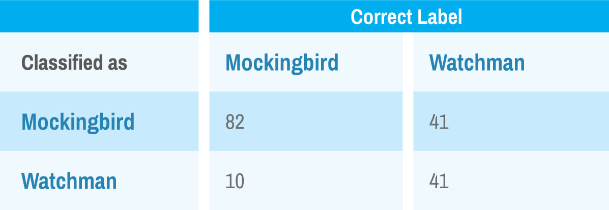

## Unsolved Mystery
Did Harper Lee write _To Kill a Mockingbird?_ The recent _'discovery'_ and subsequent publication of Harper Lee's earlier novel _Go Set a Watchmen_ has generated renewed scrutiny of the chain of events. Is the newly published book a discarded rough draft that was to become the universally beloved classic, or was it a truly forgotten separate work that deserves to be cast in the literary limelight for analysis? A concise summary of the publishing controversy was written in an [op-ed column](http://www.nytimes.com/2015/07/25/opinion/joe-nocera-the-watchman-fraud.html) by the New York Times.

The new book offers curious readers an opportunity to analyze the two works together with machine learning tools that are ideal for classifying text among a corpus of documents. Apache Spark has a mature set of libraries for text-based analysis that can be leveraged with very few lines of code.

The publisher of _Go Set a Watchman_ is unlikely to make available their best seller even for lofty academic purposes. Luckily, the Wall Street Journal printed the [first chapter](http://www.wsj.com/articles/harper-lees-go-set-a-watchman-read-the-first-chapter-1436500861) on July 10, 2015 for anyone to analyze. In this use case, features will be extracted from the first chapter of each book, and then a model will be built to show the difference between them. Comparing passages from each may provide clues as to the authorship.

### Dissecting a Classic by the Numbers
The theory behind document classification is that text from the same source will contain similar combinations of words with comparable frequency. Any conclusions based from this type of analysis are only as strong as that assumption.

To build a model to classify documents, text must be translated into numbers. This involves standardizing the text, converting to numbers (via hashing) then adjusting the word importance based on its relative frequency.

Text standardization was done with Apache Lucene. An example below shows how to perform this with the Spark shell:

```bash
./bin/spark-shell --packages \
   "org.apache.lucene:lucene-analyzers-common:5.1.0"
val line="Flick. A tiny, almost invisible movement, " +
  "and the house was still."
val tokens=Stemmer.tokenize(line)
# tokens: Seq[String] = ArrayBuffer(flick, tini, almost,
#   invis, movement, hous, still)
```

The Stemmer object that invokes the Lucene analyzer comes from an article on [classifying documents using Naive Bay on Apache Spark / MLlib](https://chimpler.wordpress.com/2014/06/11/classifiying-documents-using-naive-bayes-on-apache-spark-mllib/). Notice how the line describing the tranquility of the Radley house is affected. The punctuation and capitalization is removed, and words like "house" are stemmed, so tokens with the same root ("housing", "housed", etc.) will be considered equal. Next, we translate those tokens into numbers and count how often they appear in each line. Spark's HashingTF library performs both operations simultaneously.

```scala
import org.apache.spark.mllib.feature.HashingTF
val tf = new HashingTF(10)

val hashed = tf.transform(tokens)
```

A "hash" is a one-way translation from text to an integer (i.e. once it's translated, there's no way to go back). Initializing the hash with HashingTF(10) notifies Spark we want every string mapped to the integers 0-9. The transform method performs the hash on each word, and then provides the frequency count for each. This is an impractical illustration and would result in a huge number of "collisions" (different strings assigned the same number).

The default size of the resulting Vector of token frequencies is 1,000,000. The size and number of collisions are inversely related. But a large hash also requires more memory. If your corpus contains millions of documents, this is an important factor to consider. For this analysis, a hash size of 10,000 was used.

The last step in the text-preparation process is to account for the rareness of words- we want to reward uncommon words such as "chifferobe" with more importance than frequent words such as "house" or "brother". This is referred to as TF-IDF transformation and is available as an (almost) one-liner in Spark.

```scala
import org.apache.spark.mllib.feature.IDF
val idfModel = new IDF(minDocFreq = 3).fit(trainDocs)
val idfs = idfModel.transform(hashed)
```

The "fit" method of the IDF library examines the entire corpus to tabulate the document count for each word. On the second pass, Spark creates the TF-IDF for each non-zero element (tokeni) as the following: <!--<p><span class="math-tex" data-type="tex"><span class="math-tex" data-type="tex">\(TFIDF_i = {\sqrt{TF} *ln(doc\ count + 1/doc\ count_i + 1)}\)</span></span></p>-->


A corpus of many documents is needed to create an IDF dictionary, so in the example above, excerpts from both novels were fed into the fit method. The transform method was then used to convert individual passages to TF-IDF vectors.

Having been transformed into TF-IDF vectors, passages from both books are now ready to be classified.

### Building the Classifier
The secret to getting value from business problems is not the classification; it is primarily about ranking objects based on the confidence of our decision and then leveraging the value of a good decision minus the cost of a misidentification. Spark has several machine learning algorithms that are appropriate for this task.

During examination of the text it was noted that a few modifications should be made to the novels to make the comparison more "fair". To Kill a Mockingbird was written in the first person and includes many pronouns that would be giveaways (e.g. "I","our","my","we", etc.). These were removed from both books. Due to the inevitability of variable sentence length in novels, passages were created as series of ten consecutive words.

The parsed passages were combined, split into training and testing sets, and then transformed with the idfModel built on the training data using the code below:

```scala
val data = mockData.union(watchData)
val splits = data.randomSplit(Array(0.7, 0.3))
val trainDocs = splits(0).map{ x=>x.features}
val idfModel = new IDF(minDocFreq = 3).fit(trainDocs)
val train = splits(0).map{
  point=>LabeledPoint(point.label,idfModel.transform(point.features))
}
val test = splits(1).map{
  point=>LabeledPoint(point.label,idfModel.transform(point.features))
}
train.cache()
```

Using randomly split data files for training and testing a model is standard procedure for insuring performance is not a result of over-training (i.e. memorizing the specific examples instead of abstracting the true patterns). It is critical that the idfModel is built only on the training data. Failure to do so may result in over-stating your performance on the test data.

The data are prepared for machine learning algorithms in Spark. Naïve Bayes is a reasonable first choice for document classification. The code below shows the training and evaluation of a Naïve Bayes model on the passages.

```scala
import org.apache.spark.mllib.classification.{NaiveBayes,
  NaiveBayesModel}
val nbmodel = NaiveBayes.train(train, lambda = 1.0)
val bayesTrain = train.map(p => (nbmodel.predict(p.features), p.label))
val bayesTest = test.map(p => (nbmodel.predict(p.features), p.label))
println("Mean Naive Bayes performance")
(bayesTrain.filter(x => x._1 == x._2).count() /
  bayesTrain.count().toDouble,
  bayesTest.filter(x => x._1 == x._2).count() /
  bayesTest.count().toDouble)
```

Applying the Naïve Bayes algorithm in Spark gives a classification from which accuracy and a confusion matrix can be derived. The method makes the correct classification on 90.5% of the train records and 70.7% of the test records (performance on the training is almost always better than the test). The confusion matrix on the test data appears below:



The diagonal elements of the confusion matrix represent correct classifications and the off-diagonal counts are classification errors. It is informative to look at a confusion matrix (especially when there are more than two classes). The better the classification rate on the test set, the more separable the populations. However, when data scientists are looking to apply classification to a business problem, they prefer to examine how well the algorithm rank-orders the results.

Currently, Spark does not support a user-supplied threshold for Naïve Bayes. Only the best classification rate in the training data is reported. But in real business problems there is an overhead associated with a misclassification so that the "best" rate may not be the optimal rate. It is of keen interest to the business to find the point at which maximum value of correct classifications is realized when accounting for incorrect answers. To do this via Spark, we need to use methods that allow for analysis of the threshold.

Given the number of features (a TF-IDF vector of size 10,000) and the nature of the data, Spark's tree-based ensemble methods are appropriate. Both Random Forest and Gradient Boosted Trees are available.

```scala
import org.apache.spark.mllib.tree.RandomForest
import org.apache.spark.mllib.tree.model.RandomForestModel
import org.apache.spark.mllib.tree.GradientBoostedTrees
import org.apache.spark.mllib.tree.configuration.BoostingStrategy
import org.apache.spark.mllib.tree.model.GradientBoostedTreesModel

// RANDOM FOREST REGRESSION
val categoricalFeaturesInfo = Map[Int, Int]()
val numClasses = 2
val featureSubsetStrategy = "auto"
val impurity = "variance"
val maxDepth = 10
val maxBins = 32
val numTrees = 50
val modelRF = RandomForest.trainRegressor(train,
  categoricalFeaturesInfo, numTrees, featureSubsetStrategy,
  impurity, maxDepth, maxBins)

// GRADIENT BOOSTED TREES REGRESSION
val boostingStrategy = BoostingStrategy.defaultParams("Regression")
boostingStrategy.numIterations = 50
boostingStrategy.treeStrategy.maxDepth = 5
boostingStrategy.treeStrategy.categoricalFeaturesInfo = Map[Int, Int]()
val modelGB = GradientBoostedTrees.train(train, boostingStrategy)
```

The regression model options (estimating vs. classifying) will produce continuous outputs that can be used to find the right threshold. Both of these methods can be configured with tree depth and number of trees– read the Spark documentation for details, but general rules of thumb are the following:
- Random Forest: trees are built in parallel and over training decreases with more trees so setting this number to be large is a great way to leverage a Hadoop environment. The max depth should be larger than GBT.
- Gradient Boosted Trees: the number of trees is directly related to over training and the trees are not built in parallel. This method can produce some extremely high classification rates on the training data, but set the max depth of trees to be smaller than random forest.

The table below shows the commands to calculate the ROC (Receiver Operating Characteristic) for the Random Forest model--the ROC will tell the real story on the model performance.

```scala
//// Random forest model metrics on training data
val trainScores = train.map { point =>
  val prediction = modelRF.predict(point.features)
  (prediction, point.label)

//// Random forest model metrics on training data
val trainScores = train.map { point =>
  val prediction = modelRF.predict(point.features)
  (prediction, point.label)
}
val metricsTrain = new BinaryClassificationMetrics(trainScores,100)
val trainroc= metricsTrain.roc()
trainroc.saveAsTextFile("/ROC/rftrain")
metricsTrain.areaUnderROC()
```

These are the training results.

```scala
//// Random forest model metrics on test data
val testScores = test.map { point =>
  val prediction = modelRF.predict(point.features)
  (prediction, point.label)
}
val metricsTest = new BinaryClassificationMetrics(testScores,100)
val testroc= metricsTest.roc()
testroc.saveAsTextFile("/ROC/rftest")
metricsTest.areaUnderROC()
```

These are the test results.

To calculate an ROC, the following steps are performed:

Results are binned according to score (highest to lowest).
1. In each bin, the number of each class is tabulated (Mockingbird vs Watchman passages).
2. Starting with the highest bin, generate a data point containing the cumulative percent of the total Mockingbird and Watchman passages that have occurred.
3. Graphing those points for the Random Forest and Gradient Boosted Trees yields the following curves:


The diagonal "baseline" is the performance one could expect from random guessing (i.e. selecting 50% of the passages, you would expect to find half of each book's examples). Any performance better than that is considered the "lift" delivered by the model. It should be intuitive from examining the graph that steeper, higher curves provide greater lift. The table below quantifies the area under the ROC, which is a standard metric used by data scientists to evaluate the performance of many models simultaneously.


The Gradient Boosted Tree model achieved an essentially perfect 1.0 area under the curve. This implies that the model scored all Mockingbird passages higher than all Watchman passages. However, the Random Forest model has higher performance on the test set (0.884 vs 0.867) so it is assumed to generalize better.

In the setting of a business problem, the underlying data of the ROC is used to estimate how many items of interest can be identified when the real cost of an error is considered. Focusing on the highest scoring items from the model and working down the list is where real value comes from.

The results cannot be interpreted as conclusive, but there is significant lift displayed on these curves, and that doesn't look good for Harper Lee.

### The Verdict
There are plenty of great tools to build classification models. Apache Spark provides an excellent framework for building solutions to business problems that can extract value from massive, distributed datasets.

Machine learning algorithms cannot answer the great mysteries of life. But they do provide evidence for humans to consider when interpreting results, assuming the right question is asked in the first place.

Readers are encouraged to check out these books themselves and reach their own conclusions. If the controversy surrounding the publication of Harper Lee's books causes more people to read them, that's probably a good thing.

All of the data and code to train the models and make your own conclusions using Apache Spark are located in [github](https://github.com/joebluems/Mockingbird).
