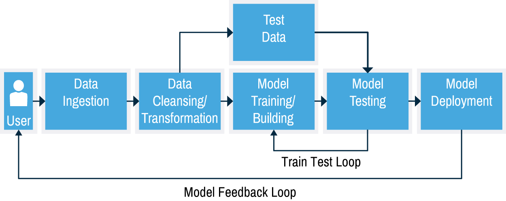
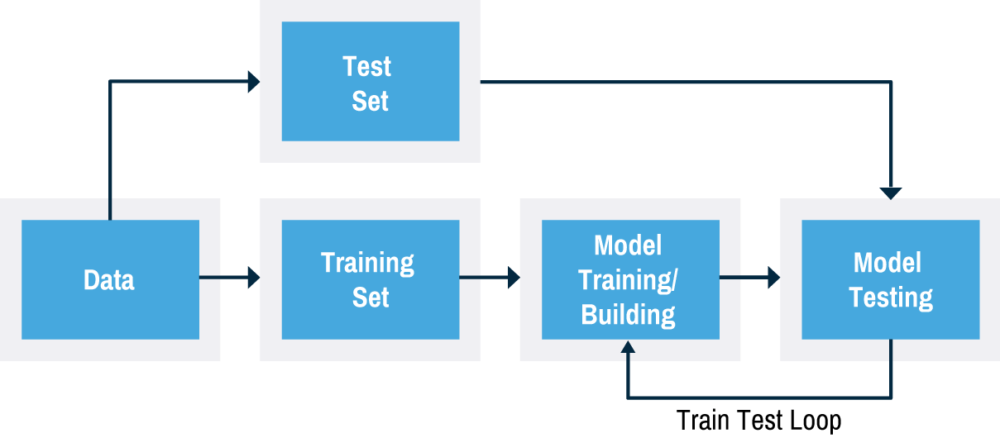

# In-Depth Use Cases
In a similar way to Chapter 5, we will be looking into new and exciting ways to use Spark to solve real business problems. Instead of touching on simpler examples, it is time to get into the details. These are complicated problems that are not easily solved without today's current big data technologies. It's a good thing Spark is such a capable tool set.

The first use case will show you how to build a recommendation engine. While the use case focuses on movies, recommendation engines are used all across the Internet, from applying customized labels to email, to providing a great book suggestion, to building a customized advertising engine against custom-built user profiles. Since movies are fun to watch and to talk about and are ingrained into pop culture, it only makes sense to talk about building a movie recommendation engine with Spark.

The second use case is an introduction to unsupervised anomaly detection. We will explore data for outliers with Spark. Two unsupervised approaches for detecting anomalies will be demonstrated; clustering and unsupervised random forests. The examples will use the KDD'99 dataset, commonly used for network intrusion illustrations.

The final and perhaps most intellectually stimulating use case attempts to answer a half-a-century old question, did Harper Lee write _To Kill a Mockingbird?_ For many years, conspiracy buffs supported the urban legend that Truman Capote, Lee's close friend with considerably more literary creds, might have ghost-authored the novel. The author's reticence on that subject (as well as every other subject) fueled the rumors and it became another urban legend. This in-depth analysis digs into this question and uses Spark in an attempt to answer this question once and for all.

## Making Recommendations with Spark
Recommendation systems help narrow your choices to those that best meet your particular needs, and they are among the most popular applications of big data processing. This use case uses machine learning to perform parallel and iterative processing in Spark and covers:
- Collaborative filtering for recommendations with Spark
- Loading and exploring the sample data set with Spark
- Using Spark MLlib's Alternating Least Squares algorithm to make movie recommendations
- Testing the results of the recommendations

### Collaborative Filtering with Spark
Collaborative filtering algorithms recommend items (this is the _filtering_ part) based on preference information from many users (this is the _collaborative_ part). The collaborative filtering approach is based on similarity; the basic idea is people who liked similar items in the past will like similar items in the future. In the example below, Ted likes movies A, B, and C. Carol likes movies B and C. Bob likes movie B. To recommend a movie to Bob, we calculate that users who liked B also liked C, so C is a possible recommendation for Bob. Of course, this is a tiny example. In real situations, we would have much more data to work with.
<figure><figcaption>Users Item Rating Matrix</figcaption></figure>

Spark MLlib implements a collaborative filtering algorithm called [Alternating Least Squares (ALS)](https://spark.apache.org/docs/latest/mllib-collaborative-filtering.html).

ALS approximates the sparse user item rating matrix of dimension K as the product of two dense matrices--User and Item factor matrices of size U×K and I×K (see picture below). The factor matrices are also called latent feature models. The factor matrices represent hidden features which the algorithm tries to discover. One matrix tries to describe the latent or hidden features of each user, and one tries to describe latent properties of each movie.
<figure><figcaption>Calculation of a recommendation</figcaption></figure>

ALS is an _iterative algorithm_. In each iteration, the algorithm alternatively fixes one factor matrix and solves for the other, and this process continues until it converges. This alternation between which matrix to optimize is where the "alternating" in the name comes from.

### Typical Machine Learning Workflow
A typical machine learning workflow is shown below.
<figure><figcaption>Maching Learning Workflow</figcaption></figure>

This code will perform the following steps:
1. Load the sample data.
2. Parse the data into the input format for the ALS algorithm.
3. Split the data into two parts: one for building the model and one for testing the model.
4. Run the ALS algorithm to build/train a user product matrix model.
5. Make predictions with the training data and observe the results.
6. Test the model with the test data.

### The Sample Set
The table below shows the Rating data fields with some sample data:

user id | movie id | rating
------- | -------- | ------
1       | 1193     | 4

The table below shows the Movie data fields with some sample data:

movie id | title     | genre
-------- | --------- | ---------
1        | Toy Story | animation

First, let's explore the data using Spark DataFrames with questions like:
- Count the max, min ratings along with the number of users who have rated a movie.
- Display the title for movies with ratings > 4

## Loading Data into Spark DataFrames
First, we will import some packages and instantiate a sqlContext, which is the entry point for working with structured data (rows and columns) in Spark and allows for the creation of DataFrame objects.

```scala
// SQLContext entry point for working with structured data
val sqlContext = new org.apache.spark.sql.SQLContext(sc)

// This is used to implicitly convert an RDD to a DataFrame.
import sqlContext.implicits._
// Import Spark SQL data types
import org.apache.spark.sql._
// Import mllib recommendation data types
import org.apache.spark.mllib.recommendation.{ALS,
  MatrixFactorizationModel, Rating}
```

Below we use Scala case classes to define the Movie and User schemas corresponding to the movies.dat and users.dat files.

```scala
// input format MovieID::Title::Genres
case class Movie(movieId: Int, title: String, genres: Seq[String])

// input format is UserID::Gender::Age::Occupation::Zip-code
case class User(userId: Int, gender: String, age: Int,
  occupation: Int, zip: String)
```

The functions below parse a line from the movie.dat, user.dat, and rating.dat files into the corresponding Movie and User classes.

```scala
// function to parse input into Movie class
def parseMovie(str: String): Movie = {
      val fields = str.split("::")
      assert(fields.size == 3)
      Movie(fields(0).toInt, fields(1))
 }

// function to parse input into User class
def parseUser(str: String): User = {
      val fields = str.split("::")
      assert(fields.size == 5)
      User(fields(0).toInt, fields(1).toString, fields(2).toInt,
        fields(3).toInt, fields(4).toString)
 }
```

Below we load the data from the ratings.dat file into a Resilient Distributed Dataset (RDD). RDDs can have **transformations** and **actions**.

```scala
 // load the data into a RDD
val ratingText = sc.textFile("/user/user01/moviemed/ratings.dat")

// Return the first element in this RDD
ratingText.first()
```

The _first()_ **action** returns the first element in the RDD, which is the String **"1::1193::5::978300760"**.

We use the org.apache.spark.mllib.recommendation.Rating class for parsing the ratings.dat file. Later we will use the Rating class as input for the ALS run method.

Then we use the map **transformation** on _ratingText_, which will apply the _parseRating_ function to each element in _ratingText_ and return a new RDD of Rating objects. We cache the ratings data, since we will use this data to build the matrix model. Then we get the counts for the number of ratings, movies and users.

```scala
// function to parse input UserID::MovieID::Rating
// Into org.apache.spark.mllib.recommendation.Rating class
def parseRating(str: String): Rating= {
      val fields = str.split("::")
      Rating(fields(0).toInt, fields(1).toInt, fields(2).toDouble)
}

// create an RDD of Ratings objects
val ratingsRDD = ratingText.map(parseRating).cache()

// count number of total ratings
val numRatings = ratingsRDD.count()

// count number of movies rated
val numMovies = ratingsRDD.map(_.product).distinct().count()

// count number of users who rated a movie
val numUsers = ratingsRDD.map(_.user).distinct().count()
```

### Explore and Query with Spark DataFrames
Spark SQL provides a programming abstraction called DataFrames. A DataFrame is a distributed collection of data organized into named columns. Spark supports automatically converting an RDD containing case classes to a DataFrame with the method _toDF_, and the case class defines the schema of the table.

Below we load the data from the users and movies data files into an RDD, use the _map()_ **transformation** with the parse functions, and then call _toDF()_ which returns a DataFrame for the RDD. Then we register the DataFrames as temp tables so that we can use the tables in SQL statements.

```scala
// load the data into DataFrames
val usersDF = sc.textFile("/user/user01/moviemed/users.dat")
  .map(parseUser).toDF()
val moviesDF = sc.textFile("/user/user01/moviemed/movies.dat")
  .map(parseMovie).toDF()

// create a DataFrame from the ratingsRDD
val ratingsDF = ratingsRDD.toDF()

// register the DataFrames as a temp table
ratingsDF.registerTempTable("ratings")
moviesDF.registerTempTable("movies")
usersDF.registerTempTable("users")
```

DataFrame _printSchema()_ prints the schema to the console in a tree format.

```scala
usersDF.printSchema()

moviesDF.printSchema()

ratingsDF.printSchema()
```

Here are some example queries using Spark SQL with DataFrames on the Movie Lens data. The first query gets the maximum and minimum ratings along with the count of users who have rated a movie.

```scala
// Get the max, min ratings along with the count of users who have
// rated a movie.
val results = sqlContext.sql(
  "select movies.title, movierates.maxr, movierates.minr, movierates.cntu
    from(SELECT ratings.product, max(ratings.rating) as maxr,
    min(ratings.rating) as minr,count(distinct user) as cntu
    FROM ratings group by ratings.product ) movierates
    join movies on movierates.product=movies.movieId
    order by movierates.cntu desc")

// DataFrame show() displays the top 20 rows in  tabular form
results.show()
```

The query below finds the users who rated the most movies, then finds which movies the most active user rated higher than 4. We will get recommendations for this user later.

```scala
// Show the top 10 most-active users and how many times they rated
// a movie
val mostActiveUsersSchemaRDD = sqlContext.sql(
  "SELECT ratings.user, count(*) as ct from ratings group by
  ratings.user order by ct desc limit 10")

println(mostActiveUsersSchemaRDD.collect().mkString("\n"))

// Find the movies that user 4169 rated higher than 4
val results = sqlContext.sql("SELECT ratings.user, ratings.product,
  ratings.rating, movies.title FROM ratings JOIN movies
  ON movies.movieId=ratings.product
  where ratings.user=4169 and ratings.rating > 4")

results.show
```

### Using ALS with the Movie Ratings Data
Now we will use the MLlib ALS algorithm to learn the latent factors that can be used to predict missing entries in the user-item association matrix. First we separate the ratings data into training data (80%) and test data (20%). We will get recommendations for the training data, and then we will evaluate the predictions with the test data. This process of taking a subset of the data to build the model and then verifying the model with the remaining data is known as cross validation; the goal is to estimate how accurately a predictive model will perform in practice. To improve the model, this process is often done multiple times with different subsets; we will only do it once.
<figure><figcaption>Training Loop</figcaption></figure>

We run ALS on the input trainingRDD of Rating(user, product, rating) objects with the rank and Iterations parameters:
- rank is the number of latent factors in the model.
- iterations is the number of iterations to run.

The ALS run(trainingRDD) method will build and return a MatrixFactorizationModel, which can be used to make product predictions for users.

```scala
// Randomly split ratings RDD into training  
// data RDD (80%) and test data RDD (20%)
val splits = ratingsRDD.randomSplit(Array(0.8, 0.2), 0L)

val trainingRatingsRDD = splits(0).cache()
val testRatingsRDD = splits(1).cache()

val numTraining = trainingRatingsRDD.count()
val numTest = testRatingsRDD.count()
println(s"Training: $numTraining, test: $numTest.")

// build a ALS user product matrix model with rank=20, iterations=10
val model = (new ALS().setRank(20).setIterations(10)
  .run(trainingRatingsRDD))
```

### Making Predictions
Now we can use the MatrixFactorizationModel to make predictions. First, we will get movie predictions for the most active user, 4169, with the recommendProducts() method, which takes as input the userid and the number of products to recommend. Then we print out the recommended movie titles.

```scala
// Get the top 4 movie predictions for user 4169
val topRecsForUser = model.recommendProducts(4169, 5)

// get movie titles to show with recommendations
val movieTitles=moviesDF.map(array => (array(0), array(1)))
  .collectAsMap()

// print out top recommendations for user 4169 with titles
topRecsForUser.map(rating => (movieTitles(
  rating.product), rating.rating)).foreach(println)
```

### Evaluating the Model
Next, we will compare predictions from the model with actual ratings in the _testRatingsRDD_. First we get the user product pairs from the _testRatingsRDD_ to pass to the MatrixFactorizationModel _predict_(user: Int, product: Int) method, which will return predictions as _Rating_(user, product, rating) objects.

```scala
// get user product pair from testRatings
val testUserProductRDD = testRatingsRDD.map {
  case Rating(user, product, rating) => (user, product)
}

// get predicted ratings to compare to test ratings
val predictionsForTestRDD  = model.predict(testUserProductRDD)

predictionsForTestRDD.take(10).mkString("\n")
```

Now we will compare the test predictions to the actual test ratings. First we put the predictions and the test RDDs in this key, value pair format for joining: ((user, product), rating). Then we print out the (user, product), (test rating, predicted rating) for comparison.

```scala
// prepare predictions for comparison
val predictionsKeyedByUserProductRDD = predictionsForTestRDD.map{
  case Rating(user, product, rating) => ((user, product), rating)
}

// prepare test for comparison
val testKeyedByUserProductRDD = testRatingsRDD.map{
  case Rating(user, product, rating) => ((user, product), rating)
}

//Join the test with predictions
val testAndPredictionsJoinedRDD = testKeyedByUserProductRDD
  .join(predictionsKeyedByUserProductRDD)

// print the (user, product),( test rating, predicted rating)
testAndPredictionsJoinedRDD.take(3).mkString("\n")
```

The example below finds false positives by finding predicted ratings which were >= 4 when the actual test rating was <= 1. There were 557 false positives out of 199,507 test ratings.

```scala
val falsePositives = (testAndPredictionsJoinedRDD
  .filter{case ((user, product), (ratingT, ratingP)) =>
    (ratingT <= 1 && ratingP >=4)})
falsePositives.take(2)

falsePositives.count
```

Next we evaluate the model using Mean Absolute Error (MAE). MAE is the absolute differences between the predicted and actual targets.

```scala
// Evaluate the model using Mean Absolute Error (MAE) between test
// and predictions
val meanAbsoluteError = testAndPredictionsJoinedRDD.map {
  case ((user, product), (testRating, predRating)) =>
    val err = (testRating - predRating)
    Math.abs(err)
}.mean()
```

<nobr/>
<aside data-type="sidebar">

<p class="partner">Use case provided by our friends: Teradata</p>

<h2>Introduction to Unsupervised Anomaly Detection</h2>

<p>The term anomalous data refers to data that are different from what are expected or normally occur. Detecting anomalies is important in most industries. For example, in network security, anomalous packets or requests can be flagged as errors or potential attacks. In customer security, anomalous online behavior can be used to identify fraud. And in manufacturing and the Internet of Things, anomaly detection is useful for identifying machine failures.</p>

<p>Anomaly detection flags "bad" data—whether that refers to data quality, malicious action, or simply user error. And because bad data are typically—and hopefully—rare, modeling bad data can be difficult when data are sampled. But the act of sampling eliminates too many or all of the anomalies needed to build a detection engine. Instead, you want large data sets—with all their data quality issues—on an analytics platform that can efficiently run detection algorithms. Apache Spark, as a parallelized big data tool, is a perfect match for the task of anomaly detection.</p>

<p>By framing anomalies as "bad data," it becomes clear that the patterns of what we call "bad data" change over time. It’s an arms race: the act of fixing an error will likely result in new errors and stopping one type of attack may lead malicious actors to devise new attacks. Because of an ever-changing environment, detection should not be fixated on one anomalous pattern. What is required then is an unsupervised approach (i.e., one that does not require training data with records flagged as anomalous or not).</p>

<h3>Getting Started</h3>

<p>Using the KDD'99 data set, we will filter out a number of columns for two reasons: ease of example and removal of labeled data, as this use case only demonstrates unsupervised approaches.</p>

<pre data-code-language="python" data-type="programlisting">
import numpy as np
INPUT = "hdfs://localhost/data/kdd"

def parse_line(line):
  bits = line.split(",")
  return np.array([float(e) for e in bits[4:12]])

df = sc.textFile(INPUT).map(parse_line)
</pre>

<h3>Identifying Univariate Outliers</h3>

<p>To begin, we want to get summary statistics for columns in our data. The <em>stats()</em> function provides these summaries. We can then use the results to get all records where the first column lies more than two standard deviations from the mean:</p>

<pre data-code-language="python" data-type="programlisting">
stats = df.map(lambda e: e[0]).stats()
mean, stdev = stats.mean(), stats.stdev()
outliers = df.filter(lambda e: not (mean - 2 * stdev &gt; e[0] &gt; mean + 2 * stdev))
outliers.collect()
</pre>

<p>Unfortunately, this approach has two limitations. First, it requires knowledge of the parameter distribution: in this case, it assumes data follow a roughly normal distribution. Second, in this example we can only determine outliers by looking at individual variables, but anomalous data is often defined by the relationship between variables. For example, going to the money transfer page of a bank is normal, but doing so without first visiting an account page can signal a fraudulent agent. Thus, we should move ahead with a multivariate approach instead.</p>

<h3>Detection with Clustering</h3>

<p>Clustering refers to an unsupervised approach whereby data points close to one another are grouped together. A common approach called k-means will produce k clusters where the distance between points is calculated using Euclidean distance. This approach can be quickly run in Spark via MLlib:</p>

<pre data-code-language="python" data-type="programlisting">
from pyspark.mllib.clustering import KMeans
clusters = KMeans.train(df, 5, maxIterations=10,
    runs=1, initializationMode="random")
</pre>

<p>There are now five clusters created. We can see the size of each cluster by labeling each point and counting. However, note that determining the optimal number of clusters requires iteratively building a model, omitted here because we move to an alternative approach in the next section.</p>

<pre data-code-language="python" data-type="programlisting">
cluster_sizes = df.map(lambda e: clusters.predict(e)).countByValue()
</pre>

<p>K-means is sensitive to outliers. This means that anomalous data often ends up in clusters alone. Looking at the <em>cluster_sizes</em> dictionary, we find clusters 0 and 2 have 1 and 23 data points each, suggesting they are anomalous. But we cannot be certain without further inspection.</p>

<p>However, because we have a small number of clusters (and probably too few), we may find anomalous data within non-anomalous clusters. A first inspection should look at the distribution of distances of data points from cluster centers:</p>

<pre data-code-language="python" data-type="programlisting">
def get_distance(clusters):
  def get_distance_map(record):
    cluster = clusters.predict(record)
    centroid = clusters.centers[cluster]
    dist = np.linalg.norm(record - centroid)
    return (dist, record)
  return get_distance_map

data_distance = df.map(get_distance(clusters))
hist = data_distance.keys().histogram(10)
</pre>

<p>Looking at the histogram (represented as a Python list) shows that occurrences of values decline as the distance grows, with the exception of a spike in the last bucket. Those data points are a good starting place to seek anomalies.</p>

<p>K-means clustering is a powerful tool. However, it does have a number of challenges. First, selecting the appropriate value for k can be difficult. Second, K-means is sensitive to the scale of variables (see Exercise 2). Last, there are no thresholds or scores that can be readily used to evaluate new data as anomalous. Because of these limitations, let us move on to an alternative approach.</p>

<p><em>Exercise 1</em>: Run these calculations and explore the data points. Can you explain the bump at the end of the histogram?</p>

<p><em>Exercise 2</em>: K-means is sensitive to the scale of variables. This means variables with larger variance will overtake your calculations. Try standardizing variables by subtracting the mean and dividing by the standard deviation for each. How does this change your results?</p>

<h3>Detection with Unsupervised Random Forests</h3>

<p>Random forests are a powerful prediction method that uses collections of trees with a random parameter holdout to build models that often outperform individual decision trees. However, the random forest is normally a supervised approach, requiring labeled data.</p>

<p>In this section, we introduce a method for turning a supervised model into an unsupervised model for anomaly detection. Unsupervised random forests have a number of advantages over k-means for simple detection. First, they are less sensitive to variable scale. Second, they can fit to "normal" behavior and thus can provide a probability of a data point being anomalous.</p>

<p>To create an unsupervised model from a supervised one, we create a new dataset of "dummy" data. We create dummy data by sampling from within columns of the original data and joining those columns. This creates a dataset whose column values are non-anomalous, but whose relationships between columns are. The unisample function provides an example:</p>

<pre data-code-language="python" data-type="programlisting">
def unisample(df, fraction=1.0):
  columns = df.first()
  new_df = None
  for i in range(0, len(columns)):
    column = df.sample(withReplacement=True, fraction=fraction) \
            .map(lambda row: row[i]) \
            .zipWithIndex() \
            .map(lambda e: (e[1], [e[0]]))
    if new_df is None:
      new_df = column
    else:
      new_df = new_df.join(column)
      new_df = new_df.map(lambda e: (e[0], e[1][0] + e[1][1]))
  return new_df.map(lambda e: e[1])
</pre>

<p>Next we label the dummy data 0 (for "not real") and original data 1 (for "real"). The <em>supervised2unsupervised</em> function shows how to create such a dataset. It also takes a supervised model and returns an unsupervised model, which we will do next:</p>

<pre data-code-language="python" data-type="programlisting">
def supervised2unsupervised(model):
  def run(df, \*args, \**kwargs):
    unisampled_df = unisample(df)
    unisampled_df = unisample(df)
    labeled_data = df.map(lambda e: LabeledPoint(1, e)) \
             .union(unisampled_df.map(lambda e: LabeledPoint(0, e)))
    return model(labeled_data, \*args, \**kwargs)
  return run
</pre>

<p>Now we can create and fit an unsupervised random forest using the RandomForest function provided by MLlib:</p>

<pre data-code-language="python" data-type="programlisting">
from pyspark.mllib.regression import LabeledPoint
from pyspark.mllib.tree import RandomForest

unsupervised_forest = supervised2unsupervised(RandomForest.trainClassifier)
rf_model = unsupervised_forest(df, numClasses=2, categoricalFeaturesInfo={},
                  numTrees=10, featureSubsetStrategy="auto",
                  impurity='gini', maxDepth=15, maxBins=50)
</pre>

<p>We have now created a new model (<em>rf_model</em>) that is trained to recognize "normal" data, giving us a robust anomaly detection tool without requiring labeled data. And anytime we run <em>rf_model.predict</em>, we can get a probability of a data point being anomalous!</p>

<p><em>Exercise 3</em>: The forest in this example has suboptimal parameters (e.g., only have 10 trees). Reconfigure the forest to improve the overall prediction accuracy of non-anomalous data.</p>

<p><em>Exercise 4</em>: This approach is sensitive to the dummy data generated. Either by "unisampling" with subsets or other approaches, try and bootstrap many forests. Create a single <em>predict</em> function that returns the mean and standard deviation across this collection of models. Use this to generate confidence intervals over your predictions.</p>

</aside>

## Unsolved Mystery
Did Harper Lee write _To Kill a Mockingbird?_ The recent _'discovery'_ and subsequent publication of Harper Lee's earlier novel _Go Set a Watchmen_ has generated renewed scrutiny of the chain of events. Is the newly published book a discarded rough draft that was to become the universally beloved classic, or was it a truly forgotten separate work that deserves to be cast in the literary limelight for analysis? A concise summary of the publishing controversy was written in an [op-ed column](http://www.nytimes.com/2015/07/25/opinion/joe-nocera-the-watchman-fraud.html) by the New York Times.

The new book offers curious readers an opportunity to analyze the two works together with machine learning tools that are ideal for classifying text among a corpus of documents. Apache Spark has a mature set of libraries for text-based analysis that can be leveraged with very few lines of code.

The publisher of _Go Set a Watchman_ is unlikely to make available their best seller even for lofty academic purposes. Luckily, the Wall Street Journal printed the [first chapter](http://www.wsj.com/articles/harper-lees-go-set-a-watchman-read-the-first-chapter-1436500861) on July 10, 2015 for anyone to analyze. In this use case, features will be extracted from the first chapter of each book, and then a model will be built to show the difference between them. Comparing passages from each may provide clues as to the authorship.

### Dissecting a Classic by the Numbers
The theory behind document classification is that text from the same source will contain similar combinations of words with comparable frequency. Any conclusions based from this type of analysis are only as strong as that assumption.

To build a model to classify documents, text must be translated into numbers. This involves standardizing the text, converting to numbers (via hashing), and then adjusting the word importance based on its relative frequency.

Text standardization was done with Apache Lucene. An example below shows how to perform this with the Spark shell:

```bash
./bin/spark-shell --packages \
   "org.apache.lucene:lucene-analyzers-common:5.1.0"
val line="Flick. A tiny, almost invisible movement, " +
  "and the house was still."
val tokens=Stemmer.tokenize(line)
# tokens: Seq[String] = ArrayBuffer(flick, tini, almost,
#   invis, movement, hous, still)
```

The Stemmer object that invokes the Lucene analyzer comes from an article on [classifying documents using Naive Bayes on Apache Spark / MLlib](https://chimpler.wordpress.com/2014/06/11/classifiying-documents-using-naive-bayes-on-apache-spark-mllib/). Notice how the line describing the tranquility of the Radley house is affected. The punctuation and capitalization is removed, and words like "house" are stemmed, so tokens with the same root ("housing", "housed", etc.) will be considered equal. Next, we translate those tokens into numbers and count how often they appear in each line. Spark's HashingTF library performs both operations simultaneously.

```scala
import org.apache.spark.mllib.feature.HashingTF
val tf = new HashingTF(10)

val hashed = tf.transform(tokens)
```

A "hash" is a one-way translation from text to an integer (i.e. once it's translated, there's no way to go back). Initializing the hash with HashingTF(10) notifies Spark that we want every string mapped to the integers 0-9. The transform method performs the hash on each word, and then provides the frequency count for each. This is an impractical illustration, and would result in a huge number of "collisions" (different strings assigned the same number).

The default size of the resulting vector of token frequencies is 1,000,000. The size and number of collisions are inversely related. But a large hash also requires more memory. If your corpus contains millions of documents, this is an important factor to consider. For this analysis, a hash size of 10,000 was used.

The last step in the text preparation process is to account for the rareness of words--we want to reward uncommon words such as "chifferobe" with more importance than frequent words such as "house" or "brother". This is referred to as TF-IDF transformation and is available as an (almost) one-liner in Spark.

```scala
import org.apache.spark.mllib.feature.IDF
val idfModel = new IDF(minDocFreq = 3).fit(trainDocs)
val idfs = idfModel.transform(hashed)
```

The "fit" method of the IDF library examines the entire corpus to tabulate the document count for each word. On the second pass, Spark creates the TF-IDF for each non-zero element (tokeni) as the following: <!--<p><span class="math-tex" data-type="tex"><span class="math-tex" data-type="tex">\(TFIDF_i = {\sqrt{TF} *ln(doc\ count + 1/doc\ count_i + 1)}\)</span></span></p>-->
<figure><figcaption>The "fit" method equation</figcaption></figure>

A corpus of many documents is needed to create an IDF dictionary, so in the example above, excerpts from both novels were fed into the fit method. The transform method was then used to convert individual passages to TF-IDF vectors.

Having been transformed into TF-IDF vectors, passages from both books are now ready to be classified.

### Building the Classifier
The secret to getting value from business problems is not the classification; it is primarily about ranking objects based on the confidence of our decision and then leveraging the value of a good decision minus the cost of a misidentification. Spark has several machine learning algorithms that are appropriate for this task.

During examination of the text, it was noted that a few modifications should be made to the novels to make the comparison more "fair." _To Kill a Mockingbird_ was written in the first person and includes many pronouns that would be giveaways (e.g., "I", "our", "my", "we", etc.). These were removed from both books. Due to the inevitability of variable sentence length in novels, passages were created as a series of ten consecutive words.

The parsed passages were combined, split into training and testing sets, and then transformed with the idfModel built on the training data using the code below:

```scala
val data = mockData.union(watchData)
val splits = data.randomSplit(Array(0.7, 0.3))
val trainDocs = splits(0).map{ x=>x.features}
val idfModel = new IDF(minDocFreq = 3).fit(trainDocs)
val train = splits(0).map{
  point=>LabeledPoint(point.label,idfModel.transform(point.features))
}
val test = splits(1).map{
  point=>LabeledPoint(point.label,idfModel.transform(point.features))
}
train.cache()
```

Using randomly split data files for training and testing a model is standard procedure for insuring performance is not a result of over-training (i.e., memorizing the specific examples instead of abstracting the true patterns). It is critical that the idfModel is built only on the training data. Failure to do so may result in overstating your performance on the test data.

The data are prepared for machine learning algorithms in Spark. Naive Bayes is a reasonable first choice for document classification. The code below shows the training and evaluation of a Naive Bayes model on the passages.

```scala
import org.apache.spark.mllib.classification.{NaiveBayes,
  NaiveBayesModel}
val nbmodel = NaiveBayes.train(train, lambda = 1.0)
val bayesTrain = train.map(p => (nbmodel.predict(p.features), p.label))
val bayesTest = test.map(p => (nbmodel.predict(p.features), p.label))
println("Mean Naive Bayes performance")
(bayesTrain.filter(x => x._1 == x._2).count() /
  bayesTrain.count().toDouble,
  bayesTest.filter(x => x._1 == x._2).count() /
  bayesTest.count().toDouble)
```

Applying the Naive Bayes algorithm in Spark gives a classification from which accuracy and a confusion matrix can be derived. The method makes the correct classification on 90.5% of the train records and 70.7% of the test records (performance on the training is almost always better than the test). The confusion matrix on the test data appears below:
<figure><figcaption>Naive Bayes Confusion Matrix on test data</figcaption></figure>

The diagonal elements of the confusion matrix represent correct classifications and the off-diagonal counts are classification errors. It is informative to look at a confusion matrix (especially when there are more than two classes). The better the classification rate on the test set, the more separable the populations. However, when data scientists are looking to apply classification to a business problem, they prefer to examine how well the algorithm rank-orders the results.

Currently, Spark does not support a user-supplied threshold for Naive Bayes. Only the best classification rate in the training data is reported. But in real business problems, there is an overhead associated with a misclassification so that the "best" rate may not be the optimal rate. It is of keen interest to the business to find the point at which maximum value of correct classifications is realized when accounting for incorrect answers. To do this via Spark, we need to use methods that allow for analysis of the threshold.

Given the number of features (a TF-IDF vector of size 10,000) and the nature of the data, Spark's tree-based ensemble methods are appropriate. Both Random Forest and Gradient Boosted Trees are available.

```scala
import org.apache.spark.mllib.tree.RandomForest
import org.apache.spark.mllib.tree.model.RandomForestModel
import org.apache.spark.mllib.tree.GradientBoostedTrees
import org.apache.spark.mllib.tree.configuration.BoostingStrategy
import org.apache.spark.mllib.tree.model.GradientBoostedTreesModel

// RANDOM FOREST REGRESSION
val categoricalFeaturesInfo = Map[Int, Int]()
val numClasses = 2
val featureSubsetStrategy = "auto"
val impurity = "variance"
val maxDepth = 10
val maxBins = 32
val numTrees = 50
val modelRF = RandomForest.trainRegressor(train,
  categoricalFeaturesInfo, numTrees, featureSubsetStrategy,
  impurity, maxDepth, maxBins)

// GRADIENT BOOSTED TREES REGRESSION
val boostingStrategy = BoostingStrategy.defaultParams("Regression")
boostingStrategy.numIterations = 50
boostingStrategy.treeStrategy.maxDepth = 5
boostingStrategy.treeStrategy.categoricalFeaturesInfo = Map[Int, Int]()
val modelGB = GradientBoostedTrees.train(train, boostingStrategy)
```

The regression model options (estimating vs. classifying) will produce continuous outputs that can be used to find the right threshold. Both of these methods can be configured with tree depth and number of trees. Read the Spark documentation for details, but the general rules of thumb are the following:
- Random Forest: trees are built in parallel and overtraining decreases with more trees, so setting this number to be large is a great way to leverage a Hadoop environment. The max depth should be larger than GBT.
- Gradient Boosted Trees: the number of trees is directly related to overtraining, and the trees are not built in parallel. This method can produce some extremely high classification rates on the training data, but set the max depth of trees to be smaller than random forest.

The table below shows the commands to calculate the ROC (Receiver Operating Characteristic) for the Random Forest model--the ROC will tell the real story on the model performance.

```scala
//// Random forest model metrics on training data
val trainScores = train.map { point =>
  val prediction = modelRF.predict(point.features)
  (prediction, point.label)

//// Random forest model metrics on training data
val trainScores = train.map { point =>
  val prediction = modelRF.predict(point.features)
  (prediction, point.label)
}
val metricsTrain = new BinaryClassificationMetrics(trainScores,100)
val trainroc= metricsTrain.roc()
trainroc.saveAsTextFile("/ROC/rftrain")
metricsTrain.areaUnderROC()
```

These are the training results.

```scala
//// Random forest model metrics on test data
val testScores = test.map { point =>
  val prediction = modelRF.predict(point.features)
  (prediction, point.label)
}
val metricsTest = new BinaryClassificationMetrics(testScores,100)
val testroc= metricsTest.roc()
testroc.saveAsTextFile("/ROC/rftest")
metricsTest.areaUnderROC()
```

To calculate an ROC, the following steps are performed:
1. Results are binned according to score (highest to lowest).
2. In each bin, the number of each class is tabulated (Mockingbird vs. Watchman passages).
3. Starting with the highest bin, generate a data point containing the cumulative percent of the total Mockingbird and Watchman passages that have occurred.
4. Graphing those points for the Random Forest and Gradient Boosted Trees yields the following curves:

<nobr/><figure><figcaption>ROC for test data by algorithm</figcaption></figure>

The diagonal "baseline" is the performance one could expect from random guessing (i.e., selecting 50% of the passages, you would expect to find half of each book's examples). Any performance better than that is considered the "lift" delivered by the model. It should be intuitive from examining the graph that steeper, higher curves provide greater lift. The table below quantifies the area under the ROC, which is a standard metric used by data scientists to evaluate the performance of many models simultaneously.
<figure><figcaption>Area under the ROC by algorithm</figcaption></figure>

The Gradient Boosted Tree model achieved an essentially perfect 1.0 area under the curve. This implies that the model scored all Mockingbird passages higher than all Watchman passages. However, the Random Forest model has higher performance on the test set (0.884 vs 0.867), so it is assumed to generalize better.

In the setting of a business problem, the underlying data of the ROC is used to estimate how many items of interest can be identified when the real cost of an error is considered. Focusing on the highest scoring items from the model and working down the list is where real value comes from.

The results cannot be interpreted as conclusive, but there is significant lift displayed on these curves, and that doesn't look good for Harper Lee.

### The Verdict
There are plenty of great tools to build classification models. Apache Spark provides an excellent framework for building solutions to business problems that can extract value from massive, distributed datasets.

Machine learning algorithms cannot answer the great mysteries of life. But they do provide evidence for humans to consider when interpreting results, assuming the right question is asked in the first place.

Readers are encouraged to check out these books themselves and reach their own conclusions. If the controversy surrounding the publication of Harper Lee's books causes more people to read them, that's probably a good thing.

All of the data and code to train the models and make your own conclusions using Apache Spark are located in [github](https://github.com/joebluems/Mockingbird).

## Now What?
We have covered a lot of ground in this book. This is by no means everything to be experienced with Spark. Spark is constantly growing and adding new great functionality to make programming with it easier. Projects integrating with Spark seem to pop up almost daily. The [Apache Mahout](http://mahout.apache.org/) project has done some integration to bring more machine learning libraries to Spark. Projects [Jupyter](https://jupyter.org/) and [Apache Zeppelin](http://zeppelin-project.org/) bring Spark to web notebooks.

This book will continue to evolve as things change or important new content is created within Spark. Bookmark things that you feel are important to you. If you didn't work through all the examples, come back and reference them later when you are ready.

There is also a Spark Cheat Sheet available in [HTML](apache-spark-cheat-sheet.html) and [PDF](https://www.mapr.com/apache-spark-cheat-sheet). This cheat sheet covers the most commonly referenced functionality, including links to the latest API documentation for each method covered. Hopefully this will help you become the Spark expert you want to become in no time at all.

Finally, if you haven't already, I suggest heading over and trying out the [MapR Sandbox](https://www.mapr.com/products/mapr-sandbox-hadoop/). It is a simple way to get running with Spark. The MapR Sandbox provides tutorials, demo applications, and browser-based user interfaces to let you get started quickly with Spark and Hadoop.

Good luck to you in your journey with Apache Spark.
